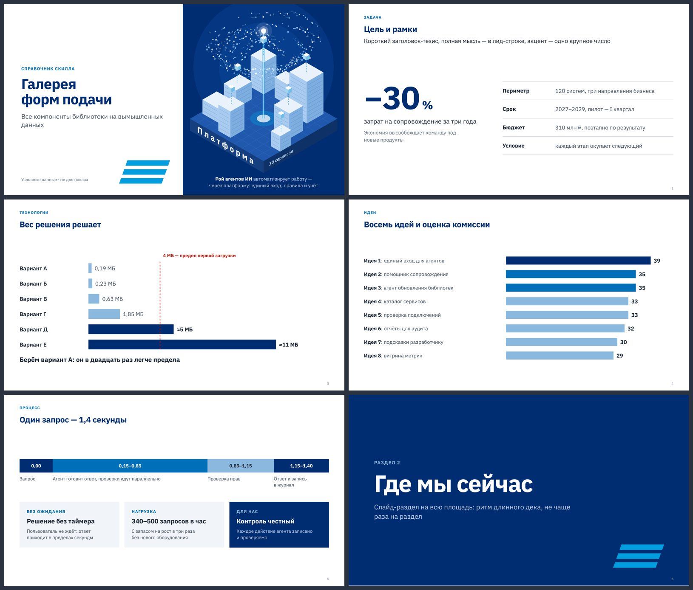
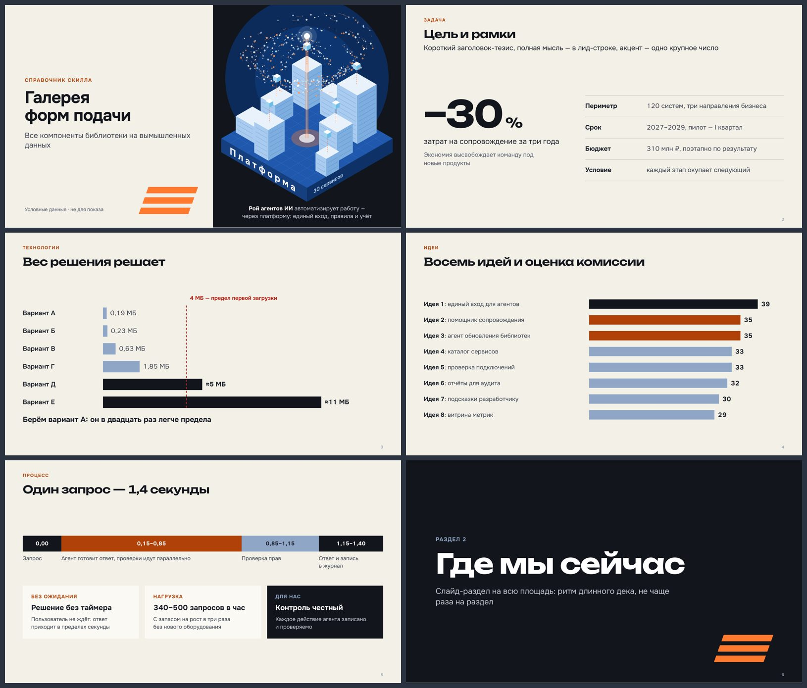
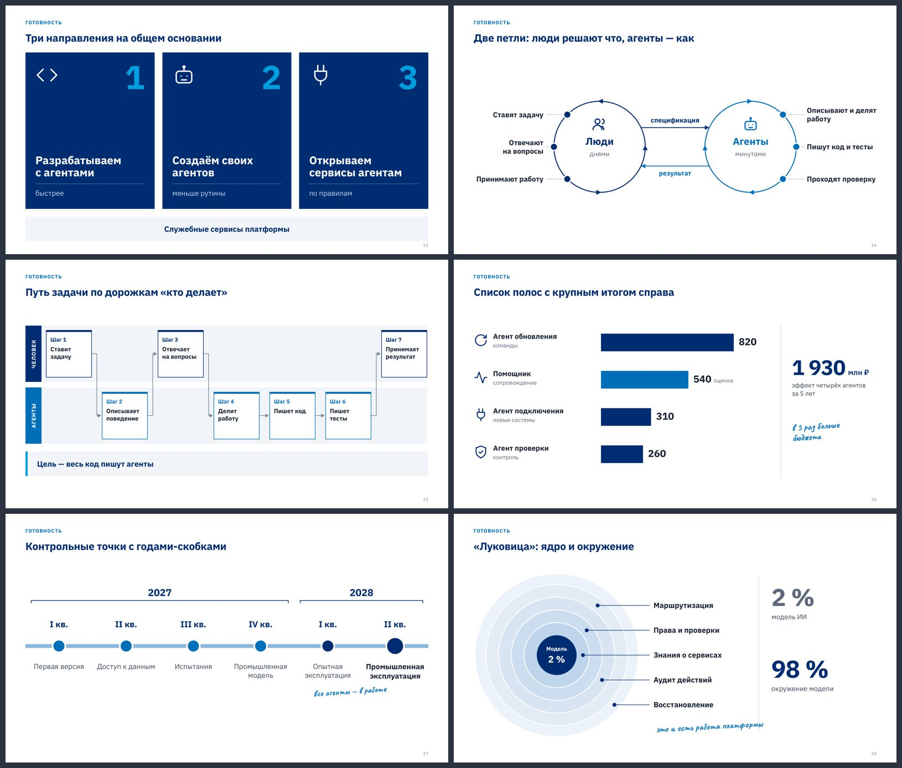
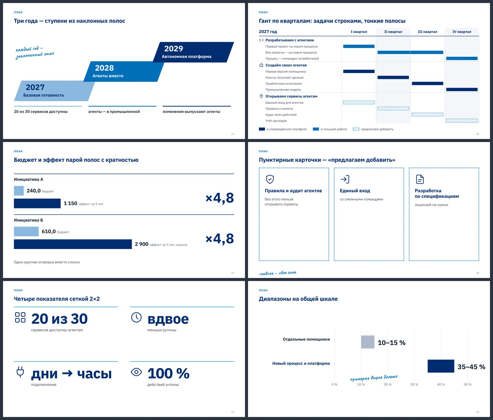

# agamora-presentations

Скилл для Claude Code: дизайнерские презентации для руководства и аналитики уровня режима Design —
на выходе **PDF и редактируемый PPTX**. Строгий аналитический стиль без признаков «вайбкодинга» и
ИИ-слопа: один смысловой объект на слайд, короткий заголовок-тезис, один акцент, профессиональная
графика (Гант, водопад, AS IS / TO BE, пороги, рейтинги, схемы), крупный текст, честные числа.

Все правила выросли из реальных замечаний руководства к десяткам деков — стратегических, по
экономическому эффекту и по детализации инициатив. Почему каждое правило существует, записано в
[`references/lessons.md`](skills/agamora-presentations/references/lessons.md).




<details><summary>Ещё формы подачи</summary>




</details>

## Что внутри

- **Свод правил** подачи, языка, чисел, композиции, цвета и форм визуализации — с причинами
  (`references/rules.md`), исполнение уровня дизайнера: порядок чтения слайда, сетка, шкала кеглей,
  контраст (`references/design.md`).
- **Библиотека `deckkit`** на Python: каркас слайда 1600 × 900, приёмы акцентов (`hero_number`,
  `threshold_bars`, `rank_bars`, `segment_bar`, `focus_cards`, `section_slide`, `takeaway`), холст схем,
  графики, Гант, AS IS / TO BE, обложки-иллюстрации, строгие линейные иконки.
- **Вывод:** HTML → PDF печатью headless Chrome; HTML → PPTX с той же геометрией — редактируемый текст,
  родные фигуры и кривые, заметки докладчика.
- **Проверка качества:** кегль от 20 px, вылеты, наложения, контраст (WCAG), перегруз, сноски, пустые
  полосы — автоматически; плюс листы кадров для просмотра глазами.
- **Встроенные шрифты** (IBM Plex Sans, Onest, Unbounded, Caveat) — дек одинаков на Windows и macOS и
  собирается без сети.
- **Бренды:** нейтральная палитра по умолчанию, профиль `editorial`, свои бренды — файлом `brand.json`.

## Установка

Как скилл — скопировать папку в личные скиллы Claude Code:

```bash
git clone https://github.com/agamoraviral/agamora-skill
cp -r agamora-skill/skills/agamora-presentations ~/.claude/skills/
```

Как плагин через маркетплейс:

```bash
claude plugin marketplace add agamoraviral/agamora-skill
claude plugin install agamora-presentations@agamora
```

Зависимости: Python 3.9+, `pip install python-pptx pymupdf pillow`, Chrome / Chromium / Edge
(путь находится сам; иначе переменная `CHROME_PATH`).

## Быстрый старт

```bash
python skills/agamora-presentations/examples/gallery.py        # галерея всех компонентов → examples/out/
```

Дальше достаточно попросить Claude: «сделай презентацию для руководства по …» — скилл подключится сам
и проведёт через бриф, сюжет, форму подачи, сборку, вывод и проверку.

## Лицензия

Двойная лицензия на выбор пользователя: [Apache-2.0](LICENSE-APACHE) или [MIT](LICENSE-MIT).
При распространении сохраняйте файл [NOTICE](NOTICE) с указанием автора.
Шрифты в `assets/fonts/` распространяются по SIL Open Font License 1.1 (файлы `OFL.txt` рядом).

© 2026 [agamoraviral](https://github.com/agamoraviral)
